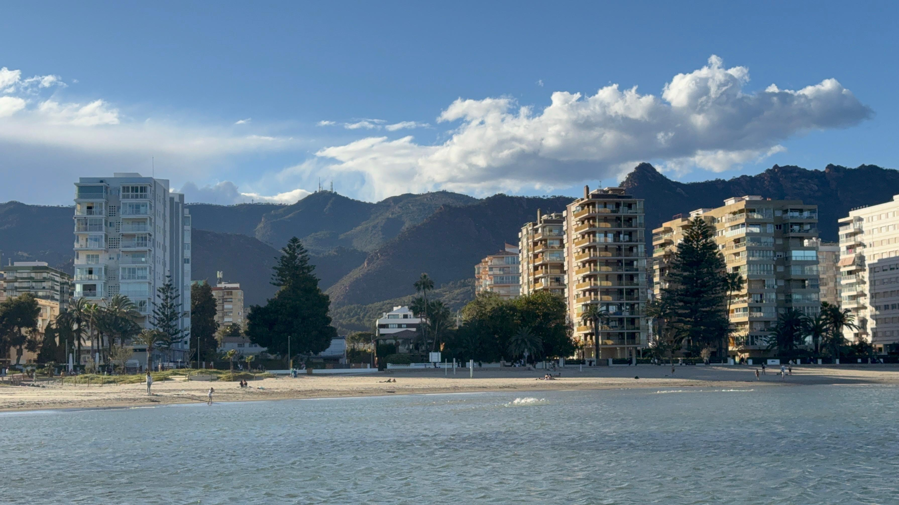
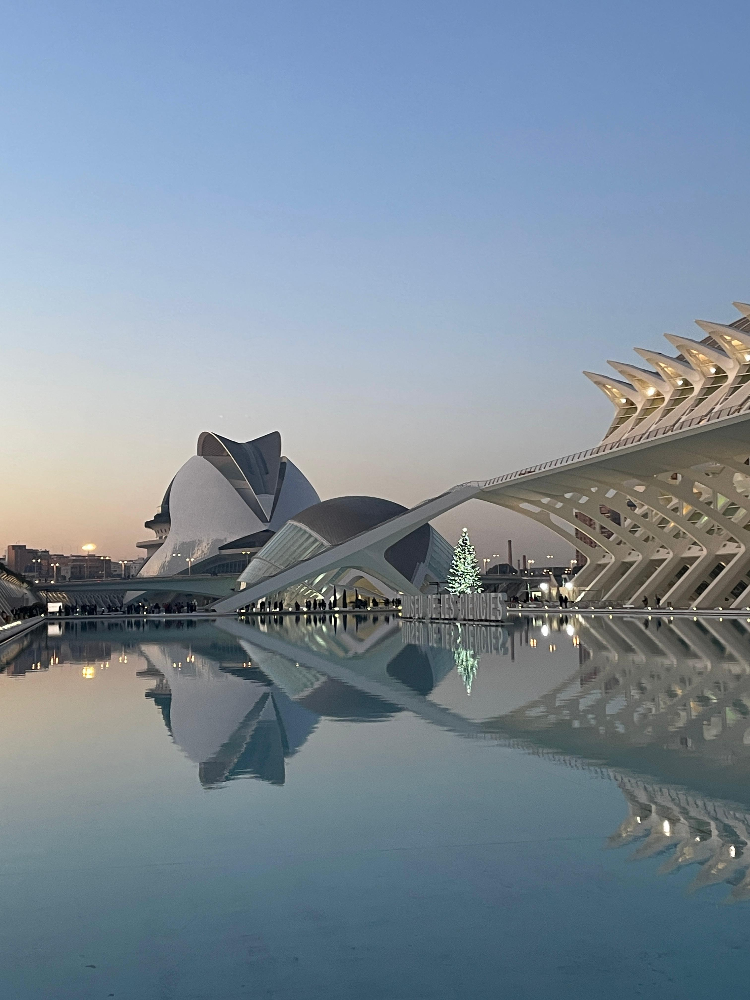
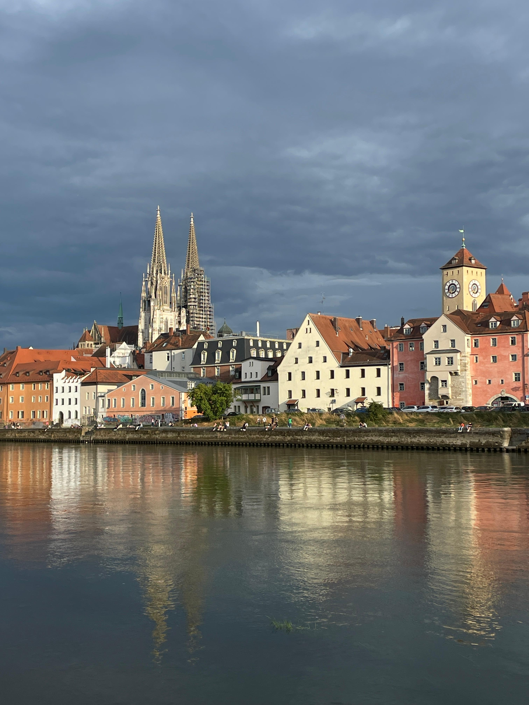
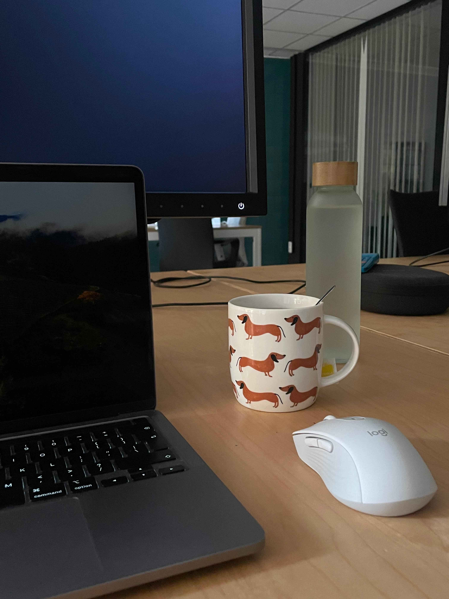
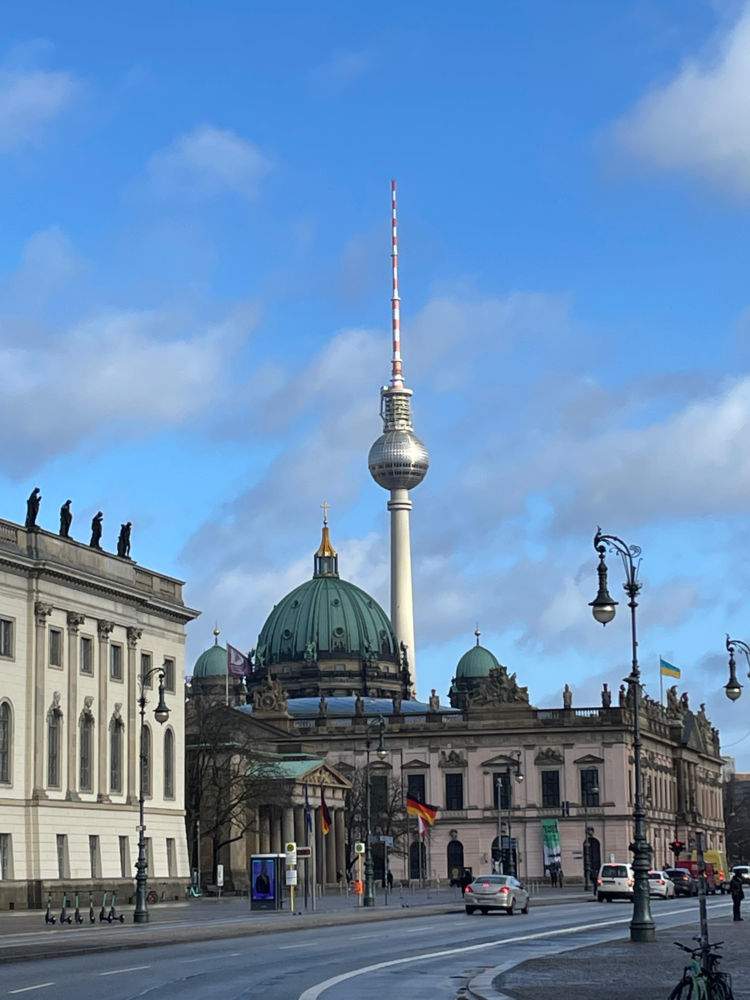
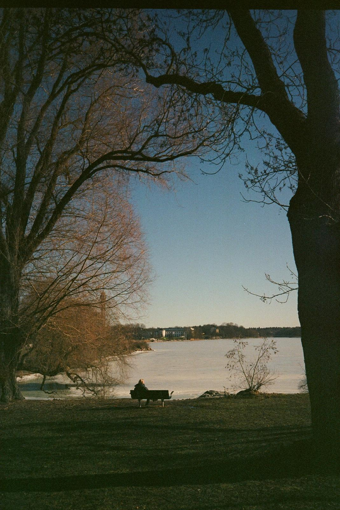
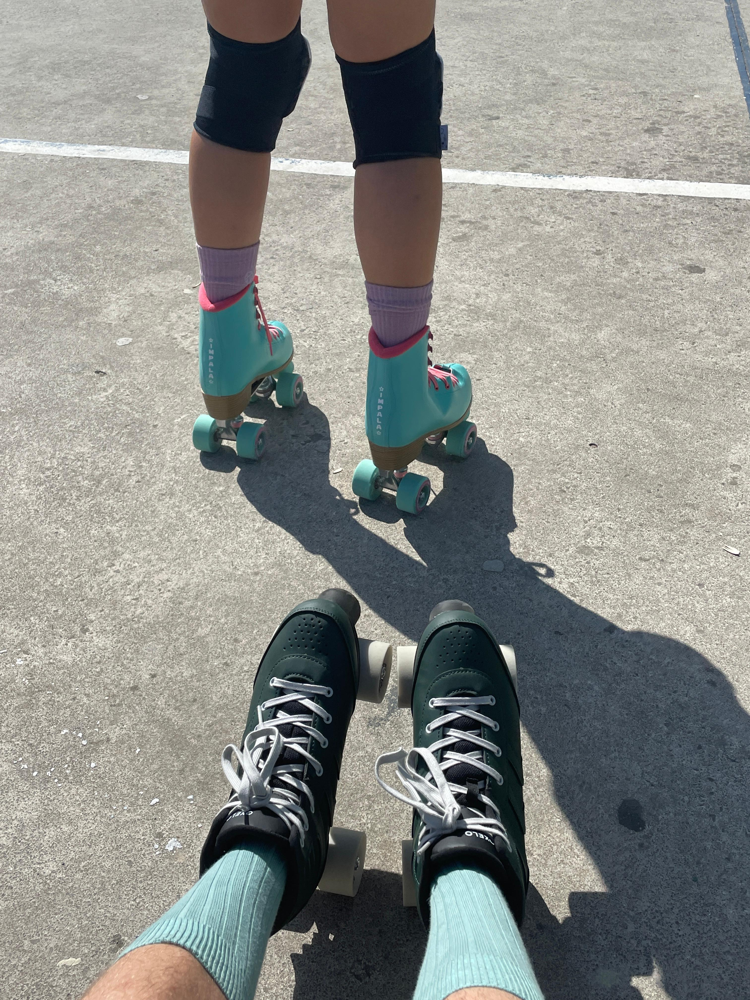
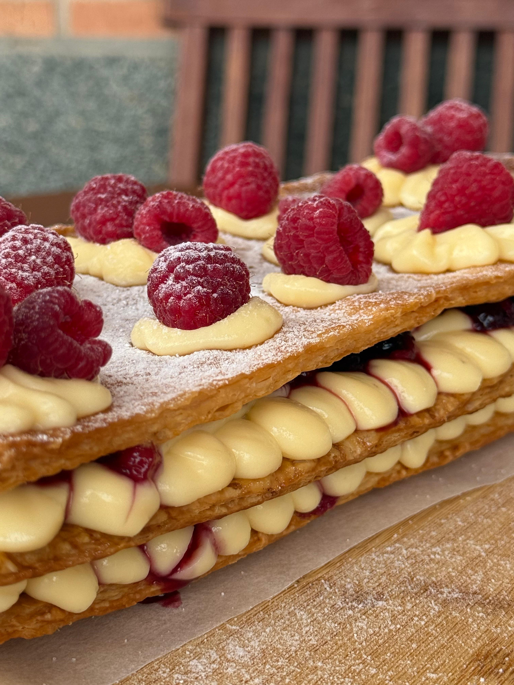

<html lang="en">
<head>
  <meta charset="UTF-8">
  <meta name="viewport" content="width=device-width, initial-scale=1.0">
  <title>Andrés | My Journey</title>
  <link href="https://fonts.googleapis.com/css2?family=Poppins:wght@500;600;700&family=Open+Sans:wght@400;600&display=swap" rel="stylesheet">
  
</head>
<body>
  

    <!-- ABOUT ME -->
    <section class="card">
      <h2>About Me</h2>
      

        
        

          
👋 Hi, I'm Andrés!

          
Born and raised in a small coastal town on the Mediterranean, I decided to pursue my Data Science studies in Valencia. Now, driven by the impact of what data can do, I am doing my master’s in Business Intelligence and Process Management.

          <a class="btn blue" href="https://www.linkedin.com/in/YOUR-PROFILE" target="_blank">LinkedIn</a>
        

      

    </section>

    <!-- STORY -->
    <section class="card">
      <h2>My Story</h2>

      

        
        

          🌊 Benicàssim, Spain
          <h3>Born and raised</h3>
          
Grew up by the Mediterranean, where the sea was never more than a few minutes away. I guess I am already missing it...

        

      

      

        
        

          🎓 Valencia, Spain
          <h3>B.Sc. Data Science, European University of Valencia</h3>
          
Moved to the city to study Data Science and discovered how much you can learn about the world from data.

        

      

      

        
        

          💼 Regensburg, Germany
          <h3>Erasmus+ Exchange</h3>
          
 Fell in love with international environments, and I guess with Germany too. Ich liebe Lüften und Apfelschorle!🍏

        

      

      

        
        

          🤖 Valencia, Spain
          <h3>Product Engineer at an ESG Company</h3>
          
Favourite working set up, early mornings and a cute dachshund mug!

        

      

      

        
        

          🏫 Berlin, Germany
          <h3>BIPM at HWR Berlin</h3>
          
Drawn by the impact of data and technology, now studying the BIPM Master.

        

      

    </section>

    <!-- HOBBIES -->
    <section class="card">
      <h2>My Hobbies</h2>
      

        

          

            
            📷
          

          
Film Photography

        

        

          

            
            🛼
          

          
Rollerskating

        

        

          

            
            🍳
          

          
Cooking

        

      

    </section>

    
    <!-- MAP -->
    <section class="card">
      <h2>My Journey</h2>
      <iframe class="map-frame" src="academic_journey_map.html" title="Map of my journey"></iframe>
    </section>

    <footer>© 2026 Andrés · Made for BIPM Data Science at HWR Berlin</footer>
  

</body>
</html>
